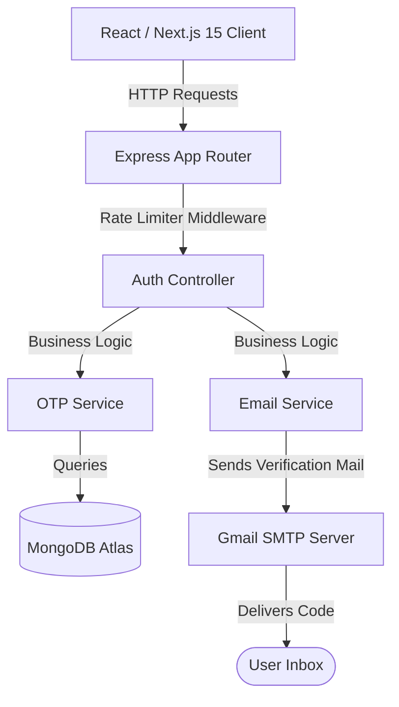

# Sri Sakthi Sarees — Premium E-Commerce Portal

[](https://mongodb.com)
[](https://nextjs.org/)
[](https://nodejs.org/)
[](https://www.typescriptlang.org/)
[](https://www.mongodb.com/)
[](https://jwt.io/)
[](https://razorpay.com/)

A full-stack, enterprise-grade e-commerce application tailored for **Sri Sakthi Sarees**, featuring a premium customer portal, modular admin capabilities, and a secure **Email OTP Authentication System** designed with production-ready security practices.

---

## 🏗️ System Architecture

The project follows a decoupled client-server architecture using the **MERN** stack, implemented in **TypeScript** for absolute type safety and robustness.



### 💻 Technology Stack
* **Frontend**: Next.js 15 (App Router), React 19, Tailwind CSS v4, Lucide React icons, React Context API.
* **Backend**: Node.js, Express.js (TypeScript compiled to ES Modules).
* **Database**: MongoDB Atlas using Mongoose ODM, utilizing MongoDB TTL (Time-To-Live) index for automated session cleanup.
* **Security & Auth**: JSON Web Tokens (JWT), Salted Password Hashing (`bcryptjs`), API Rate Limiting (`express-rate-limit`).
* **Email Service**: SMTP integration using `nodemailer` and Gmail secure App Passwords.
* **Payment Gateway**: Razorpay (Test Mode Integration) — supports order creation, payment verification, and webhook-ready architecture.

---

## 🔒 Email OTP Authentication System

The application features a secure, production-grade email verification system to authenticate and register users.

### Key Features
1. **6-Digit Secure OTP**: Auto-generated 6-digit numeric verification codes.
2. **Database Persistence & Expiration**: Saved in a dedicated `OTP` collection with an automated **5-minute TTL expiration index** managed natively by MongoDB.
3. **60-Second Cooldown**: Prevents spamming SMTP nodes by blocking subsequent OTP generation requests within 60 seconds of the last dispatch.
4. **Rate Limiting**: Defends endpoints against brute force and abuse by limiting IP requests to 5 attempts per 10 minutes.
5. **Interactive Frontend View**: Slices OTP input into 6 independent boxes with automatic focus shifting (forward-focus on keydown, backward-focus on backspace, and copy-paste clipboard parsing).
6. **Graceful Fallback Mode**: Supports memory-cache fallbacks if MongoDB or SMTP settings are offline, guaranteeing local testability.

---

## 💳 Payment Gateway: Razorpay (Test Mode Integration)

The application integrates **Razorpay** in **Test Mode** to simulate the complete order payment lifecycle without processing real transactions. This allows safe end-to-end testing of the checkout flow.

### How It Works
1. **Order Creation**: On checkout, the backend calls the Razorpay Orders API to create a tracked payment order with the cart total amount (in paise).
2. **Payment Modal**: The frontend loads the Razorpay JS SDK and opens the hosted payment modal, presenting the customer with test card/UPI/netbanking options.
3. **Payment Verification**: After payment, Razorpay sends back `razorpay_payment_id`, `razorpay_order_id`, and `razorpay_signature`. The backend verifies the HMAC-SHA256 signature to confirm authenticity before marking the order as paid.
4. **Mock Fallback**: If `RAZORPAY_KEY_ID` is not configured in `.env`, the system falls back to a mock payment confirmation so developers can test the full order flow offline.

### Test Credentials
Use these in the Razorpay payment modal during testing (no real money is charged):

| Method | Details |
| :--- | :--- |
| **Test Card Number** | `4111 1111 1111 1111` |
| **Expiry** | Any future date (e.g. `12/26`) |
| **CVV** | Any 3-digit number (e.g. `123`) |
| **UPI Test ID** | `success@razorpay` |
| **Net Banking** | Select any bank → use test credentials |

> **Note**: Switch to **Razorpay Live Mode** by replacing the Test API keys with Live keys from your [Razorpay Dashboard](https://dashboard.razorpay.com/) before going to production. Never commit live secret keys to version control.

### Required Environment Variables
```env
# Add these to backend/.env
RAZORPAY_KEY_ID=rzp_test_XXXXXXXXXXXXXX
RAZORPAY_KEY_SECRET=XXXXXXXXXXXXXXXXXXXXXXXX
```

---

## 📂 Project Structure

The project maintains a strict separation of concerns, separating business rules into distinct service layers.

```text
Sri Sakthi/
│
├── frontend/                     # Next.js Frontend Application
│   ├── src/
│   │   ├── app/                  # App Router Pages (login, cart, checkout, shop)
│   │   ├── components/           # Reusable UI Components (Navbar, Footer, Spinner)
│   │   └── context/              # Client State Management (AuthContext, CartContext)
│   └── package.json
│
├── backend/                      # Express TypeScript Backend
│   ├── src/
│   │   ├── config/               # Database and Mailer Configurations
│   │   ├── controllers/          # Request/Response Routers (authController)
│   │   ├── middleware/           # Protect routes, Rate limiters, Admin access
│   │   ├── models/               # MongoDB Mongoose Schemas (User, OTP, Product)
│   │   ├── routes/               # API Endpoints Mapper
│   │   ├── services/             # Core Business Logic (emailService, otpService)
│   │   ├── utils/                # Helper Libraries (validators)
│   │   └── server.ts             # Application Bootstrapper
│   └── package.json
└── README.md
```

---

## 📊 Database Schema Design

### User Model
Stores user details, roles, and wishlist bookmarks.
| Field | Type | Description |
| :--- | :--- | :--- |
| `name` | String | User's full name (Required) |
| `email` | String | Unique index email address (Required) |
| `phone` | String | Contact phone number (Optional) |
| `password` | String | Bcrypt-hashed password string (Required) |
| `role` | String | Enum: `super-admin` \| `admin` \| `staff` \| `user` (Default: `user`) |
| `wishlist` | ObjectId[] | Array references pointing to the `Product` collection |

### OTP Model
Manages verification status and automatically self-deletes upon expiration.
| Field | Type | Description |
| :--- | :--- | :--- |
| `email` | String | Recipient email address (Indexed, Required) |
| `otp` | String | Secure 6-digit numeric verification token (Required) |
| `createdAt` | Date | Timestamp of generation (Default: `Date.now`) |
| `expiresAt` | Date | Verification expiration deadline (5 minutes from generation) |
| `verified` | Boolean | Verification flag checked during registration (Default: `false`) |

> **TTL Indexing Rule**: Configured with `OTPSchema.index({ expiresAt: 1 }, { expireAfterSeconds: 0 })` which instructs MongoDB to delete the document as soon as `Date.now() >= expiresAt`.

---

## 🔌 API Documentation

All API responses return structured JSON formats.

### 1. Send OTP Code
* **Endpoint**: `POST /api/auth/send-otp`
* **Access**: Public (Rate limited to 5 requests / 10 minutes)
* **Request Body**:
  ```json
  { "email": "customer@example.com" }
  ```
* **Success Response (200 OK)**:
  ```json
  {
    "success": true,
    "message": "OTP sent successfully to your email."
  }
  ```

### 2. Verify OTP Code
* **Endpoint**: `POST /api/auth/verify-otp`
* **Access**: Public
* **Request Body**:
  ```json
  {
    "email": "customer@example.com",
    "otp": "584920"
  }
  ```
* **Success Response - New User Registration Flow (200 OK)**:
  ```json
  {
    "success": true,
    "message": "OTP verified successfully.",
    "isNewUser": true
  }
  ```
* **Success Response - Existing User Login Flow (200 OK)**:
  ```json
  {
    "success": true,
    "message": "OTP verified successfully.",
    "user": {
      "_id": "603d2e...",
      "name": "Jaswanth Kumar",
      "email": "customer@example.com",
      "role": "user"
    },
    "token": "eyJhbGciOiJIUzI1NiIsInR5cCI6IkpXVCJ9..."
  }
  ```

### 3. Resend OTP Code
* **Endpoint**: `POST /api/auth/resend-otp`
* **Access**: Public (Enforces a 60-second delay cooldown)
* **Request Body**:
  ```json
  { "email": "customer@example.com" }
  ```
* **Error Response - Cooldown active (429 Too Many Requests)**:
  ```json
  {
    "success": false,
    "message": "Please wait 60 seconds before requesting a new OTP."
  }
  ```

### 4. Complete Registration
* **Endpoint**: `POST /api/auth/register`
* **Access**: Public (Requires verified OTP status in database)
* **Request Body**:
  ```json
  {
    "name": "Jaswanth Kumar",
    "email": "customer@example.com",
    "phone": "9988776655",
    "password": "SecurePassword123"
  }
  ```
* **Success Response (201 Created)**:
  ```json
  {
    "success": true,
    "message": "User registered successfully.",
    "user": {
      "_id": "603d2e...",
      "name": "Jaswanth Kumar",
      "email": "customer@example.com",
      "role": "user"
    },
    "token": "eyJhbGciOiJIUzI1NiIsInR5cCI6IkpXVCJ9..."
  }
  ```

---

## 🛠️ Installation & Setup Guide

### Prerequisites
* [Node.js](https://nodejs.org/) (v18 or higher recommended)
* [MongoDB Atlas Account](https://www.mongodb.com/) or local MongoDB server

### 1. Clone & Install Dependencies
```bash
# Clone the repository
git clone https://github.com/yourusername/sri-sakthi-sarees.git
cd sri-sakthi-sarees

# Install root dependencies
npm install

# Install backend dependencies
cd backend
npm install

# Install frontend dependencies
cd ../frontend
npm install
```

### 2. Configure Environment Variables

Create a `.env` file in the `backend/` directory:
```env
PORT=5000
MONGODB_URI=mongodb+srv://<username>:<password>@cluster.mongodb.net/srisakthi?retryWrites=true&w=majority
JWT_SECRET=yoursecretjwtkey
JWT_EXPIRE=30d
SUPER_ADMIN_PASSWORD=YourSecureSuperAdminPassword
FRONTEND_URL=http://localhost:3000

# SMTP Configuration (Gmail app password)
SMTP_HOST=smtp.gmail.com
SMTP_PORT=465
SMTP_SECURE=true
SMTP_USER=yourgmailaddress@gmail.com
SMTP_PASS=your_16_character_gmail_app_password
SMTP_FROM="Sri Sakthi Sarees <yourgmailaddress@gmail.com>"

# Razorpay Payment Gateway (Test Mode)
RAZORPAY_KEY_ID=rzp_test_XXXXXXXXXXXXXX
RAZORPAY_KEY_SECRET=XXXXXXXXXXXXXXXXXXXXXXXX
```

### 3. Start Development Servers

**Start the Backend API Server**:
```bash
cd backend
npm run dev
```

**Start the Next.js Frontend Server**:
```bash
cd frontend
npm run dev
```

Open [http://localhost:3000](http://localhost:3000) to view the client-facing application.

---

## 🎓 Academic Highlights (For Lab/Project Showcases)

* **MVC Architecture Pattern**: Implemented clean separation of data (Models), routing rules (Routes), client layouts (Views), and endpoint handlers (Controllers).
* **JWT Stateless Authentication**: Promotes scalability by avoiding server-side sessions, relying on signed tokens verify-verified on route gates.
* **Database Expiry (TTL)**: Avoids storage overhead and database bloating by relying on Mongo engine indexes to auto-delete documents based on timestamp fields.
* **Client-Side Slicing Pattern**: Implements UX focus-shifting utilizing React `useRef` arrays to handle keycodes and backspace deletions.
* **Payment Gateway Integration**: Razorpay Test Mode integration demonstrating real-world payment order lifecycle — order creation, hosted modal, HMAC-SHA256 signature verification, and graceful mock fallback for offline development.
* **User-Specific Data Isolation**: Cart and Wishlist are strictly scoped to the authenticated user's `_id`, preventing data leakage across user sessions. Per-user `localStorage` keys (`cart_{userId}`, `wishlist_{userId}`) ensure clean state on login and logout.
